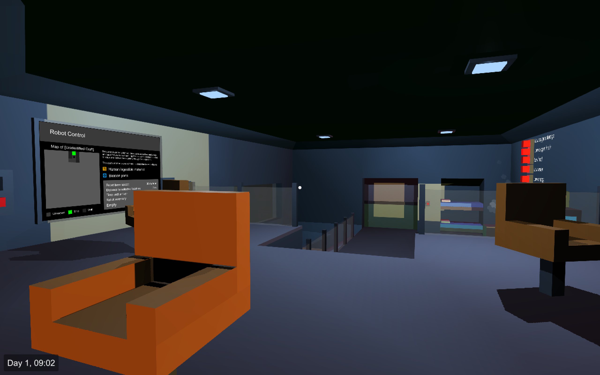

# Abandoned

*You are stuck in a small space ship, separated from your crew and all outside communication. Your only hope for escape is to survive long enough to create a distress beacon and attract a rescue party, but the required parts are scattered around the "abandoned" alien ship your crew mates so mysteriously disappeared into. Fortunately, you have remote control of a robot that can explore the alien depths while you struggle to survive.*

This is the (mostly) unaltered source code for the game I made with C# and Unity for the 37th Ludum Dare (late 2016), theme "One Room."

- Game page on [itch.io](https://epicruins195.itch.io/abandoned)
- Entry page on [Ludum Dare](http://ludumdare.com/compo/ludum-dare-37/?action=preview&uid=60072)

